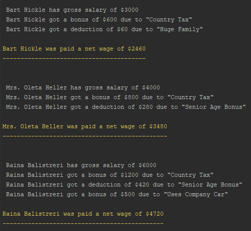

# Payroll Process System
The service of employees' net wage calculation and payment ([test task](public/task.pdf) for RealForce).

## Requirements
`docker`, `docker-compose`, `composer`, `php ^7.1`

## Installing
This step will run docker containers, install composer dependencies, migrate, load the fixtures and create `up` file.
```bash
git clone git@github.com:denysaw/payroll.git
cd payroll
./init
```

## Start the application all further times
This will only run your docker containers
```bash
./up
```

## Run the application
Executing the command, which pays calculated net salaries to all employees with a clear bonus/deduction explanation.
```bash
bin/console process:payroll
```
Command output part example snapshot:


## Test the application
Run test with `Alice/Bob/Charlie` situation from the [task](public/task.pdf)
```bash
bin/phpunit
```